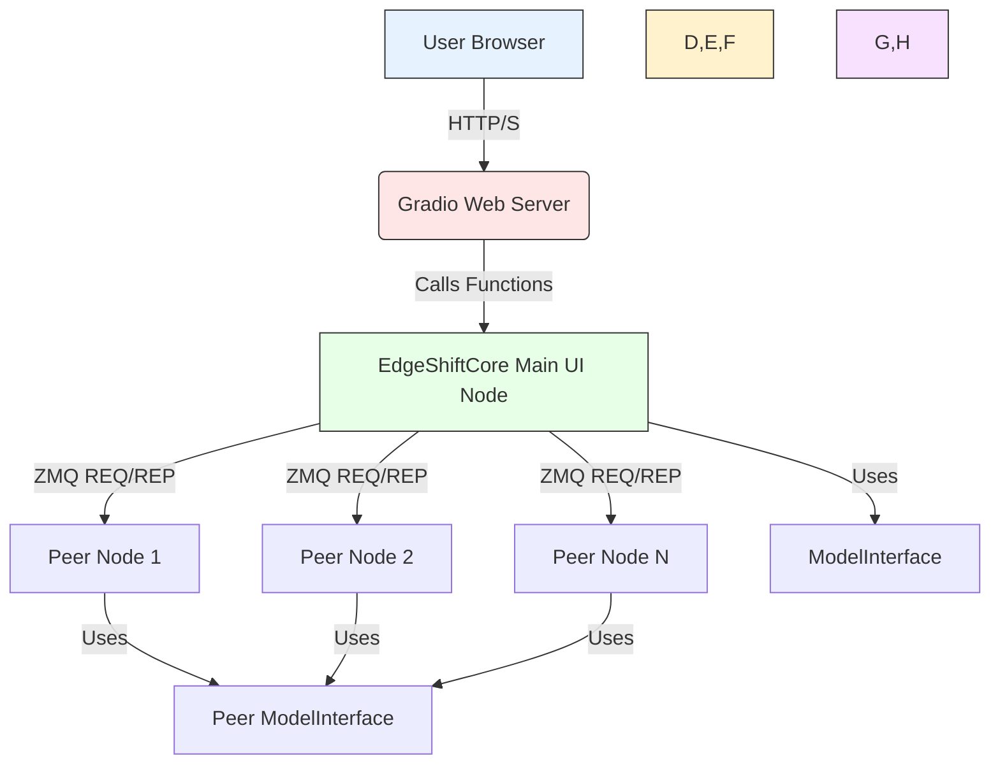
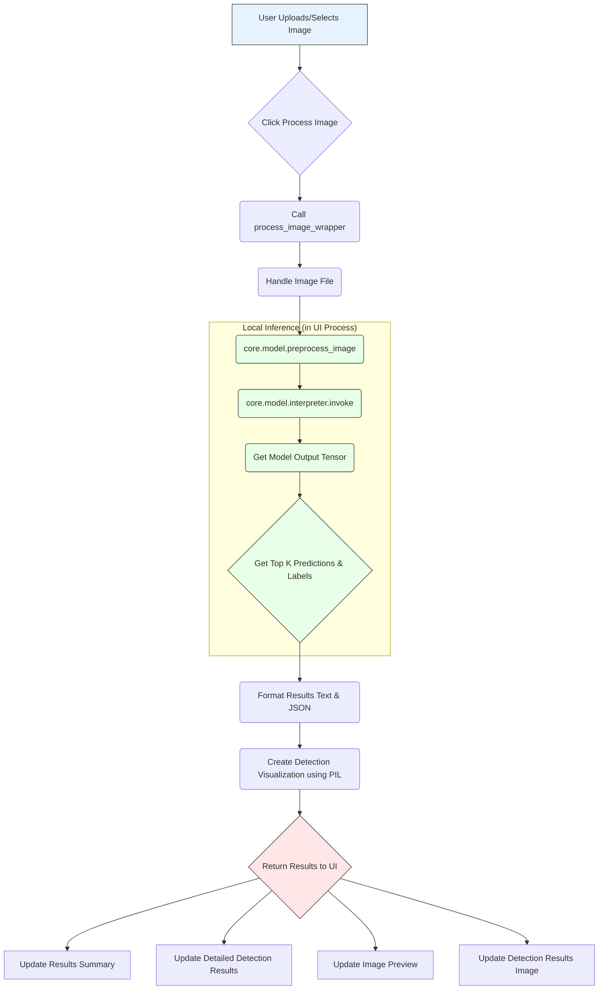

# EdgeShift: Distributed Edge Computing

## Project Description

EdgeShift is a proof-of-concept project exploring the capabilities of distributed AI inference on edge devices using a peer-to-peer architecture based on ZeroMQ. The goal is to demonstrate how computationally intensive tasks, such as image processing, can be distributed across multiple interconnected devices to leverage their collective processing power, reduce reliance on centralized cloud servers, and potentially improve latency and data privacy.

This repository contains a basic implementation with a Gradio-based user interface to monitor the network and trigger image classification tasks, along with core components for device management, task scheduling (simplified), and TFLite model inference.

## Key Concepts

*   **Decentralized Architecture:** Nodes communicate directly with each other without a central orchestrator (beyond the Main UI Node acting as a coordinator for tasks).
*   **Peer-to-Peer Communication:** Utilizes ZeroMQ for efficient and flexible messaging between devices.
*   **Edge AI Inference:** Leverages TensorFlow Lite for performing lightweight machine learning tasks directly on edge devices.
*   **Task Distribution:** Designed to distribute parts of a larger task (like image processing partitions) across available peer devices.

## Current Functionality (as of latest updates)

Based on the development work completed:

1.  **Gradio User Interface:** A web-based UI is available to interact with the system.
2.  **Network Status Monitoring:** The UI displays a list of detected/connected peer devices, their status (Active/Disconnected), and *real-time* metrics (CPU usage, Memory usage, Battery status) reported by peers (displaying simulated values if real data is not available).
3.  **Basic Network Activity Plot:** A plot shows a simple representation of network activity based on the number of active devices (Task and Load metrics are currently simulated).
4.  **Local Image Classification:** The "Image Processing" tab in the UI allows uploading an image and performing **local** TFLite image classification inference directly within the main UI node's process. The top predictions and a visualization are displayed.
5.  **Peer Connectivity:** The Main UI Node is configured to actively attempt connections to specified peer addresses (including localhost and a configured remote IP like `192.168.200.206:5556`).
6.  **Basic Peer Process:** A `run_peer` function is available to start a simple peer node that binds to a specified port, responds to pings (ideally with real system metrics, but currently displays are configured to show simulated values if needed), and simulates processing tasks.

**Note:** The full distributed image processing pipeline (partitioning images and sending partitions to peers for inference, then combining results) is part of the core logic but not fully integrated with the UI's "Process Image" button in the current demo state. The UI performs inference locally for demonstration purposes.

## Setup and Running

### Prerequisites

*   Python 3.7+ installed on all participating computers.
*   `git` installed on all participating computers.
*   Ensure computers can communicate over the network (check firewalls to allow TCP traffic on the chosen ZeroMQ ports).

### 1. Clone the Repository

On **each** participating computer, open a terminal and run:

```bash
git clone https://github.com/AsifaBeedi/EdgeShiftAI.git # Replace with your actual repo URL if different
cd EdgeShiftAI
```

*(Make sure you have pushed the latest changes from our session to your GitHub repository first)*

### 2. Install Dependencies

On **each** participating computer, navigate to the `EdgeShiftAI` directory in your terminal and run:

```bash
pip install -r requirements.txt
```

*(It's highly recommended to use a Python virtual environment)*

### 3. Set up and Run the Main UI Node (Computer A)

1.  **Find Computer A's IP Address:** On the computer you designate as Computer A, open a terminal and run `ipconfig` (Windows) or `ifconfig`/`ip addr` (Linux/macOS) to find its local IPv4 address. **Note this IP address down.**
2.  **Configure Peer Address in UI Code:** Open `edgeshift/core/gradio_ui.py` on **Computer A** in a code editor. Go to the `_discover_peers` method within the `EdgeShiftCore` class. Locate the `peer_addresses_to_try` list and ensure it includes the IP address and port you will use for the peer on Computer B (e.g., `"tcp://YOUR_COMPUTER_B_IP:5556"`). **Replace `YOUR_COMPUTER_B_IP` with the actual IPv4 address of Computer B.**
3.  **Run the UI:** In a terminal on Computer A, navigate to the `EdgeShiftAI` directory and run:
    ```bash
    python -m core.gradio_ui --zmq-port 5555 --web-port 7860
    ```
    Keep this terminal window open and running. You can access the UI in a web browser on Computer A at `http://localhost:7860` or `http://127.0.0.1:7860`.

### 4. Set up and Run a Peer Node (Computer B)

1.  **Find Computer B's IP Address:** On the computer you designate as Computer B, open a terminal and run `ipconfig` (Windows) or `ifconfig`/`ip addr` (Linux/macOS) to find its local IPv4 address. (This is the IP you used in step 3.2).
2.  **Configure Firewall:** Ensure that incoming TCP connections are allowed on the chosen peer port (e.g., 5556) in the firewall settings of Computer B.
3.  **Run the Peer Process:** In a terminal on Computer B, navigate to the `EdgeShiftAI` directory and run:
    ```bash
    python -c "from core.gradio_ui import run_peer; run_peer(5556)"
    ```
    **Replace `5556` with the actual port number you configured Computer A to connect to on Computer B.** Keep this terminal window open and running.

### 5. Verification

*   Check the terminal output on both Computer A and Computer B for connection success messages.
*   Access the Gradio UI on Computer A (`http://localhost:7860`), go to the "Network Status" tab, and click the "🔄 Refresh" button. You should see an entry for the peer on Computer B's IP address with an 'Active' status and its simulated (or real, if you modified the peer code) CPU, Memory, and Battery metrics.

## Diagrams

### SYSTEM DESIGN ARCHITECTURE



### USER INTERACTION FLOW (Current UI Demo)



## Authors and Contributors

*   **Asifa Bandulal Beedi:** [@AsifaBeedi](https://github.com/AsifaBeedi)
*   **Aayushi Dedakia:** [@nanogirl159](https://github.com/nanogirl159)

## License

This project is licensed under the MIT License - see the [LICENSE](LICENSE) file for details.
